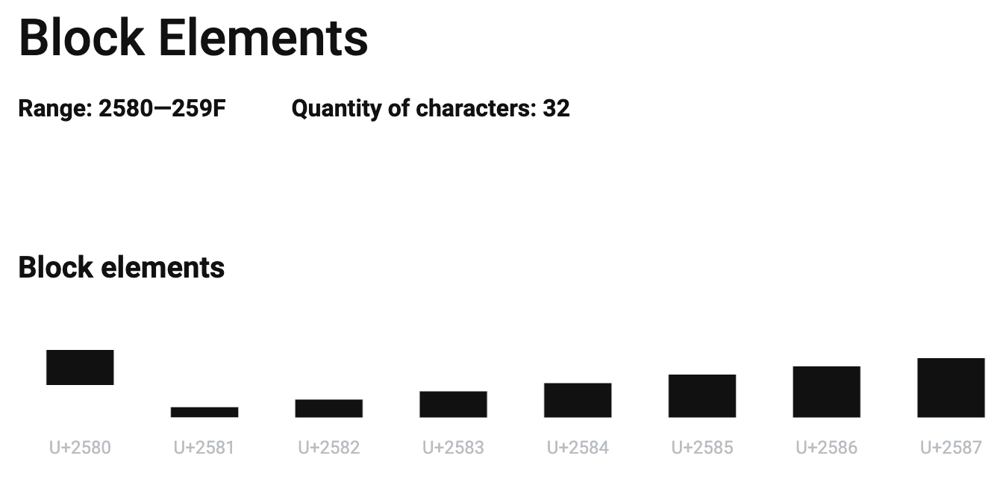

# 用 Go 语言写焦虑发生器并发布到 Rum 上·第二篇

初学 Go 语言是在去年 11 月 20 日。到今年 2022 年的 2 月 3 日，我写了一个小 bot 连续运行成功，发布到了 github 上开源。花了两个多月时间。我感觉效率还是不错的。
于是我这就来记录这段学习经历：
目的一是让同样正在跨编程入门这道薛定谔之忽高忽低门槛的小白同学一些参考，更顺利的入门编程；
目的二是回顾并巩固自己过去的学习，为下一步继续学习打好基础；
目的三是让更多的人能够对 Rum 这个新的东西感兴趣。
希望能成功达成目的：

## 生成进度条
上一篇我们写了函数，可以用 HTTP Post 方法向 Rum 发送内容，我们这一篇就来发送焦虑内容之年度进度条吧。
进度条采用文本形式，我在 Unicode 的列表里找到了一些方块：


>这个找 Unicode 的地方我提供给读者：https://unicode-table.com/

进度条的算法我是这样规定的：
整个进度条长度是30个块，把百分比换算成三十分之 N。N 是一个整数。
那么把百分之几换算成三十分之几感觉掉了很多精度，这个丢掉的精度我用一些不完整的方块来表示。我找了 quarter block 表示四分之一块，找了 half block 表示一半，three quarter block 表示四分之三块，这样至少视觉上不会感觉太“不精确”了。
照着这样的算法思路我写了生成进度条的代码如下：
``` Go
func printBar(perc float64) (bar string) { //print progress bar by percentage
	const fullB string = "\u2588" //0.9
	const halfB string = "\u2584" //0.5
	const quarterB string = "\u2582" //0.25
	const threeQuartersB string = "\u2586" //0.75
	const emptyB string = "\u2581" //0
	const ttlBs float64 = 30 //total number of blocks

	bar = ""

	fBs := int(math.Floor(perc * ttlBs))

	for i := 0; i < fBs; i++ {
		bar += fullB
	}
	
	gB := perc*ttlBs - math.Floor(perc*ttlBs) //to decide which gab block to chose.
	log.Info("the gap block indicator is:", gB)

	if gB < 0.0001 && perc < 0.9999 {
		bar += emptyB
	} else if gB >= 0.0001 && gB < 0.35 {
		bar += quarterB
	} else if gB >= 0.35 && gB < 0.6 {
		bar += halfB
	} else if gB >= 0.6 && gB < 0.85 {
		bar += threeQuartersB
	} else if perc >= 0.9999 {
		log.Info("quit earlier to prevent an extra empty block ", perc*ttlBs)
		return
	} else {
		bar += fullB
	}

	eBs := int(ttlBs) - fBs - 1
	for i := 0; i < eBs; i++ {
		bar += emptyB
	}


	content := ""
	content += "2022 进度条 / Year Progress 2022\n"
	content += bar

	now := time.Now().UTC()
	displayPerC := fmt.Sprintf("%.1f", perc*100) + "%"
	bar = content + displayPerC + "\nUTC时间: " + now.Format("2006, Jan 02, 15:04:05") + "\n"

	return
}
```

变量 bar 是函数要返回的值，也是要发送给 Rum 的全部内容。经过前面的计算，生成进度条之后，干脆在这个函数里把标题和时间戳也加上，成了最后的内容。
这个函数的一个参数是 perc，也即percentage，百分比，顺理成章的，我们需要根据时间来计算百分比了。

计算时间的百分比很简单，输入一个时间，计算从 2022 年 1 月 1 日零点，到这个时间的时间长度，再比上整个 2022 年的时间长度就好了。
代码如下：
``` GO
func timePerc(nextPost time.Time) (perc float64) { //calculate percentage
	initialTime := time.Date(2022, time.January, 1, 0, 0, 0, 0, time.UTC)
	duration := nextPost.Sub(initialTime)
	log.Info("duration is:", duration)
	perc = duration.Hours() / (365.0 * 24.0)
	log.Info("perc is:", perc)

	return
}
```

代码设置了变量 initialTime ，初始的时间，即是 2022 年 1 月 1 日零点。参数是 nextPost，类型是一个时间类型。变量 duration 就是用 nextPost 减去 initialTime 得出的时长了。精确到了小时，因为我最终输出的百分比只保留了 1 位小数点，精确到小时足够了。

## 整合三个函数
到这里我们基础的功能都已经有了，再做更进一步的优化调整前我们做一次整合。手上现在有三个函数：
``` Go
//第一个函数：
func postToRum(title string, content string, group string, url string)//发送内容给 Rum
```
输入参数 content，也即要发布的内容，参数 group 是指定要发到 Rum 的哪一个种子网络（群组）。

``` Go
//第二个函数：
func printBar(perc float64) (bar string)//生成要发送的进度条内容
```
参数 perc 是百分比，根据百分比生成内容 bar，并返回。

``` Go
//第三个函数：
func timePerc(nextPost time.Time) (perc float64)//根据时间计算百分比的函数
```
参数 nextPost 是一个时间，输入时间，返回 perc 这个百分比。

把三个函数整合到 main 函数中：
``` Go
func main() {	
	url := "https://127.0.0.1:8002/api/v1/group/content" //Rum 定义的 api
	progressBar := printBar(timePerc(time.Now().UTC())) //按照当前的UTC时间生成一个进度条
	postToRum("进度条测试", progressBar, "fe2842cb-db6b-4e8a-b007-e83e5603131c", url) //发布到Go语言学习小组

}

```

这里采用了当前的 UTC 时间，传递给 timePerc 函数，生成了百分比，把百分比传递给 printBar 函数，生成要发送的内容，赋值给变量 progressBar。
接下来把内容传递给上一篇写的函数，postToRum，礼成！

按照惯例，我把代码的全貌展示在 github 上，因为跟我一样小白的读者如果通过复制粘贴再加上自己的修修补补可能没法成功运行：