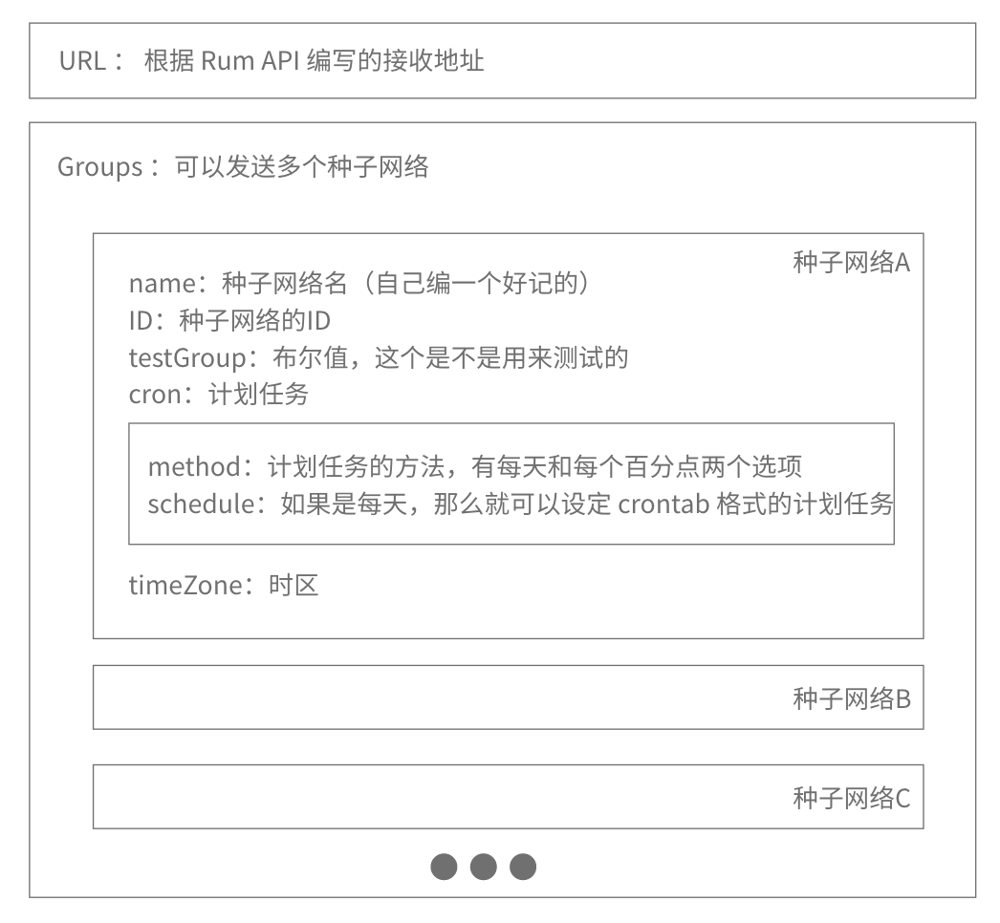

# 用 Go 语言写焦虑发生器并发布到 Rum 上·最终篇

初学 Go 语言是在去年 11 月 20 日。到今年 2022 年的 2 月 3 日，我写了一个小 bot 连续运行成功，发布到了 github 上开源。花了两个多月时间。我感觉效率还是不错的。
于是我这就来记录这段学习经历：
目的一是让同样正在跨编程入门这道薛定谔之忽高忽低门槛的小白同学一些参考，更顺利的入门编程；
目的二是回顾并巩固自己过去的学习，为下一步继续学习打好基础；
目的三是让更多的人能够对 Rum 这个新的东西感兴趣。
希望能成功达成目的：

## 到服务器上去运行 bot
Rum 是一款建立在区块链上的去中心化的内容平台。

这个定义不一定准确，因为 Rum 现在还是非常初级的阶段，想象空间非常大，提前下定义只会限制想象。这也是我选择 Rum 来学习 Go的原因吧。
前面三篇我们做好了一个可以持续运行并给 Rum 发送内容的 bot。我们自己的电脑不一定会长期在线和联网。于是我们可以在服务器上去运行 Rum，同时再运行我们写好的 bot。

我自己搭建了一个运行 Rum 服务端（Rum 服务端我们称为 quorum）的服务器环境，再用我本地的电脑去连接，以便我后续在本地写 Go 程序能够更容易地在服务器环境上去测试。这个过程我也总结了一篇文章：
[从零开始在 Ubuntu 20.04 上Build Quorum 并用本地 Rum App 进行连接](https://blog.hawken.im/2022/01/15/run-quorum-on-ubuntu/)

上面提到的文章也是写给我这样的新手小白看的，目的都是帮助新手避免踩坑，与帮助自己巩固基础并进行下一步的学习。搭建好环境之后，像我们自己在电脑上测试 bot 一样，把我们的代码放到服务器上运行就可以了。

## 变得更酷之立 flag（带参数运行）
既然到了服务器上去运行就不得不用命令行进行操作。命令行对我这个小白来说，用起来即使不方便，感觉上很酷，就够了。我们自己写的程序要是也需要输入一个带参数的命令才能运行，岂不是酷毙了。

也是一番搜索，查到我们要带参数运行命令，需要一个包叫做 flag。是的，在命令行里带参数，就是立 flag。
我们 import 这个包：
``` Go
import (
	"flag"
)
```

然后在 main 函数里立起一个新的 flag 
``` Go
	flagGroupID := flag.String("gid", "fe2842cb-db6b-4e8a-b007-e83e5603131c", "group ID, default ID is for testing")
	flag.Parse()
```

调用 flag.String 方法，需要三个参数，第一个是 flag 名，这里我写的 gid，group ID 的简写；第二个是默认值，我用了“Go语言学习小组”的 ID；第三个是一个说明文档，用户用了 -h 的 flag，可以告诉用户怎么使用。
填完了该填的参数，需要用 flag.Parse() 来解析用户传递的 flag。
最后需要注意的一点是， flag.String 返回的是一个地址，要用上 flag 的值需要加上 * 这个符号，于是 postToRum 这个函数的第三个参数现在写成这样：
``` Go
postToRum("2022 进度条", progressBar, *flagGroupID, url)
```


## 变得更酷之通过外部 config 文件配置参数
要正式运行这个代码了，会有好多测试，每次都输入一长串的 ID 感觉很麻烦而且一点都不酷。
看了大佬们的代码，经常都会有一个配置文件，把很多东西写好在配置文件上，再来运行。
酷！我们也来搞这个。

先设计一下我们配置文件的结构，之前学过一点 Json 的数据结构，所以也没多想，就用 Json 来作为配置文件的格式吧。然后画图进行一个简单的框架设计：


这里面计划的功能冗余了一些，很多都没用上，不过自己撸代码我高兴这样，按照设计写出来的 Json 文件如下：
``` Json
{
"url":"https://127.0.0.1/api/v1/group/content",
"groups":[
    {
        "name":"YearProgress 2022",
        "ID":"[quorum seednet ID]",
        "testGroup":false,
        "cron":{
            "method":"daily",
            "schedule":"0 0 * * *"
        },
        "timeZone":"UTC"
    },
    {
        "name":"Test Group",
        "ID":"[quorum seednet ID]",
        "testGroup":true,
        "cron":{
            "method":"percently",
            "schedule":"default"
        },
        "timeZone":"UTC"
    }
]
}
```

下一步是解析并读取配置文件，把刚刚的一段 Json 保存到 config.json 文件中，和代码放在一个根目录下。
读取 Json 文件：
``` Go
rawData, _ := ioutil.ReadFile("config.json") 
```

这个时候变量 rawData 储存的是 config.json 里面的字符串，也就是 String 格式。我们还需要解析到一个 struct 中，按照我们自己设定的格式来写 struct：
``` Go
type Cron struct {
	Method   string `json:"method"`
	Schedule string `json:"schedule"`
}
type Group struct {
	Name      string `json:"name"`
	ID        string `json:"ID"`
	TestGroup bool   `json:"testGroup"`
	Cron      Cron   `json:"cron"`
	TimeZone  string `json:"timeZone"`
}
type Configs struct {
	URL    string  `json:"url"`
	Groups []Group `json:"groups"`
}
```

这样我们就可以把 rawData 里面的字符串存到 Configs 这个我们新建的 struct 里，这次我们直接写一个读取 config 文档的函数好了：
``` Go
func ReadConfig(jsonFile string) *Configs { // to read config file
	rawData, _ := ioutil.ReadFile(jsonFile) // filename is the JSON file 
	var configs Configs
	json.Unmarshal(rawData, &configs)
	return &configs
}
```


## 更多：自定义包
注意到我们的 ReadConfig 函数是用的大写字母开头，因为我把 ReadConfig 函数写进了一个自定义包里。所以 ReadConfig 函数是一个公共的函数，就是说我 import 了 ReadConfig 所在的包，就可以调用这个函数。
下面就讲怎么做一个自定义包，非常简单，包名就是文件夹名，把文件夹放到根目录里。比如，我的包名就叫 readconfig，于是文件夹也叫 readconfig，文件夹里面的代码源文件名可以随便写，我就写 readconfig.go 了。
readconfig.go 的第一行不能随便写，要写成：
``` Go
package readconfig
```

于是我们就成功自定义了一个叫 readconfig 的包。
接下来把上一步写好的 ReadConfig 函数以及 Configs 的 struct，放置于 readconfig.go 里就好了。

回到根目录的 main.go，这个时候有个特别需要注意的是，因为是自定义包，我们需要在 readconfig 前面加上主包名，我这里自定义的是 yearprogress。如下：
``` Go
import (
	"yearprogress/readconfig"
)
```

主包名 yearprogress 又是在 go.mod 文件里定义的。要生成 go.mod 需要我们在命令行里输入这样的命令：
``` 
go mod init yearprogress
```

Go 语言会根据我们引用的各种包自动帮我们生成一个 go.mod 文件，用来进行包管理。

这样就算完结了，很快是不是？因为我就是这样学习的，会跳过很多知识点，直接去找能帮助我完成这个小项目的积木块。这是我自己总结的学习方法，我称之为敏捷学习法。
这里贴一个我之前写的文章叫做：
【浅尝则止是正义！逃避困难也可以！论敏捷学习方法在编程学习上的应用。】
是微信公众号链接，以后考虑逐步都转移到 github 吧：
https://mp.weixin.qq.com/s/ZmOaU_VPwSJICqGpefiwaQ
是去年5月份写的文章，年底就成功实践学了 Go 语言，说明这个学习方法还是有效果的。

按照惯例，我把代码的全貌展示在 github 上。作为小白本白，我经常复制粘贴了别人的代码再修修补补一下就没法成功运行了，所以我这里提供一个完整的可以执行的代码，修修补补出了问题可以回滚：

https://github.com/hawken-im/yearprogress/tree/main/Step3

## 以后的计划：
我通过这个小项目入门了 Go 语言，下一步打算做个稍微复杂一点的项目，具体还没有想好，当然还是会和 Rum 结合起来。
至于这个进度条小项目，我的计划是升级一个小功能，就是年末的时候可以按每 0.1% 来发布。还有就是研究 JWT，看看怎么才能稳定的远程接入 quorum（Rum 的服务器端）。
希望能帮助到读者！
